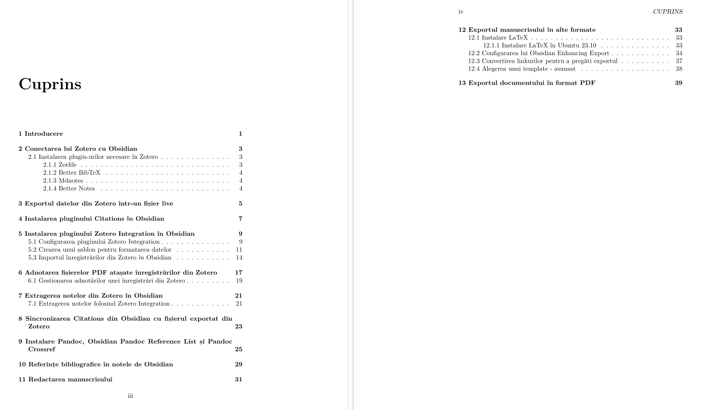

# obsidian-tutorials

Here I will keep some tutorials for Obsidian workings

Acesta este repo-ul unde veți găsi materiale dedicate extinderii practicilor personale privind munca intelectuală.

## Tutorial de lucru cu literatura științifică și scriere academică folosind Zotero, Obsidian și Pandoc

Acesta este primul tutorial care adresează modul în care pot fi valorificate bibliografiile create în Zotero prin prelucrarea notelor în Obsidian. Tutorialul merge mai departe cu toate instrucțiunile necesare pentru a crea un document pe care mai apoi îl exporți în PDF folosind Pandoc. Ceea ce aduce util materialul este explicarea practicilor de adnotare a fișierelor PDF anexate înregistrărilor bibliografice din Zotero, precum și importul dinamic al acestora în Obsidian pentru prelucrare suplimentară. Finalitatea este realizarea unui Personal Knowledge Base (PKB) care să poată oferi posibilitatea de a redacta direct notele în lucrări de mai mare dimensiuni și apoi exportarea cu atașare de bibliografie, etc.

Pachetele software folosite:

| Pachetul software | Numele pluginului | Versiune |
| ---- | ---- | ---- |
| Obsidian |  | 1.5.3 |
| Zotero |  | 6.0.30 |
| *Zotero* | Zotfile | 5.1.2 |
| *Zotero* | Better BibTeX | 6.7.140 |
| *Zotero* | Mdnotes | 0.2.3 |
| *Zotero* | Better Notes | 1.0.4 |
| *Obsidian | Citations | 0.4.5 |
| *Obsidian | Obsidian Zotero Integration | 3.1.7 |
| *Obsidian | Pandoc Reference List | 2.0.25 |
| Pandoc |  | 3.1.11 |
| pandoc-crossref |  | 0.3.17.0b |

Cuprins:

Versiunea documentului curent este 1.0.3
Ianuarie 26, 2024

Versiuni anterioare:
1.0.0 - 24 ianuarie
1.0.1 - 24 ianuarie (corecturi)
1.0.2 - 25 ianuarie (corecturi, adăugiri)
1.0.3 - 26 ianuarie (corecturi, adăugiri și material nou). P.S. Nu a fost făcut export în PDF a tutorialului actualizat.

Întregul repo poate fi descărcat și deschis ca vault în Obsidian. Pentru cei care doresc să tipărească documentul, există chiar un export în format pdf: `obsidian-zotero-pandoc.pdf`.

Fiți curioși!