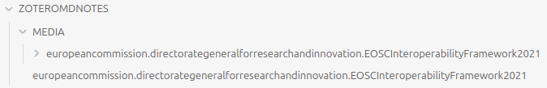
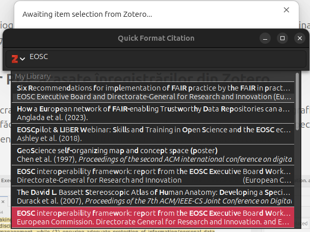

# Introducere

Contactul inițial cu Obsidian poate fi ușor rezumat ca unul limitat la instrumentele inițiale la care ai acces. În urma unei experiențe de lucru de aproape doi ani, voi puncta în acest ghid câteva rutine de configurare pe care le-am deprins. Acestea vor transforma spațiul de lucru și editare într-o zonă a căror instrumente își aduc o contribuție rapidă la procesele editoriale.
Aceste rutine de configurare aparțin autorului fără pretenția de a fi și cele pe care ar trebui să le urmați fără adaptările proprii care vă avantajează.
Acest ghid are drept scop setarea Obsidian pentru a fi un ajutor în munca intelectuală din sfera cercetării științifice.

# Configurarea editorului

Primul lucru pe care îl fac automat este să debifez opțiunea Editor -> Readable line length din Settings (CTRL + ,). Acest pas are drept efect poziționarea textului care va umple întreg spațiu al panoului de editare.
La secțiunea Appearance -> Base color scheme este din oficiu setată la valoarea *Adapt to system*. Dacă sistemul de operare are modul dark activat, Obsidian va fi în modul dark și el automat. Setați după preferință. personal prefer *Light* cu *Accent color* setat pe un ton de roșu.

# Extinderea prin instalarea de pluginuri

Din oficiu, Obsidian vine instalat cu instrumentele de bază pentru editare a notelor. În schimb, puterea sa este mult crescută prin extinderea cu pluginuri create de comunitate. Pentru a le folosi, mai întâi trebuie activat *Turn on community plugins* din secțiunea *Community plugins* a panoului setărilor (CTRL + ,). Pentru a căuta un anumit plugin, se va apăsa butonul Browse și apoi se va instala ceea ce considerați că vă este util prin accesarea pluginului și apoi apăsarea pe butonul install. Amintiți-vă mereu că imediat după ce un plugin este instalat, acesta trebuie activat apăsând pe enable sau culisând butonul de activare din lista de la *Installed plugins*. Pluginurile mai apar chiar și sub elementul de meniu *Community plugins* al panoului setărilor.


## Templater

Primul pe care vi-l recomand să-l instalați este *Templater*. Acesta este foarte util în realizarea unor șabloane pe care le veți folosi pentru a prelua date din diferite surse pe care le veți transforma în note de Obsidian.

## Obsidian Link Converter

Acest plugin este absolut util pentru a transforma sintaxa care introduce linkurile către resurse aflate în nota de Obsidian pe care o elaborați în alte formate necesare pentru diferite operațiuni de export în alte formate cum ar fi PDF. După instalare adu-ți aminte să-l activezi.

De exemplu, pentru a transforma linkurile pe care le introduce automat Obsidianul atunci când tragi o imagine în suprafața de editare în linkuri specifice formatului Markdown strict, vei apela panoul comenzilor (CTRL + p), unde vei începe să tastezi în câmpul de căutare *Convert*. Imediat vor apărea opțiunile, din care, pentru exemplificare, am ales *Obsidian Link Converter: Vault: Links to Markdown*.

![[Screenshot 2024-01-26 092040.png]]

Apăsând pe *Continue* se va produce transformarea tuturor linkurilor din document după cum se vede și din captura de ecran de mai jos.

![[Screenshot 2024-01-26 092056.png]]

Fii foarte atent la această transformare.

### Citations

Acest plugin este necesar pentru a putea afișa în bara de informație din dreapta panoului central de editare a conținutului referințelor bibliografice pe care le-ai introdus în text.
Pentru a-l folosi, mai întâi trebuie să ai la îndemână un fișier `.bib` care conține referințele bibliografice pe care le vei introduce în text.
Pentru a face lucrurile mai dinamice, acest fișier poate fi exportat automat din Zotero dacă ai instalat pluginul Better BibTeX (BBT - https://retorque.re/zotero-better-bibtex/). Dacă folosești Zotero și ai acest plugin instalat deja, poți face o salvare a colecției dorite (în Zotero: File -> Export library... -> Better BibLaTeX) în format `.bib` asigurându-te mai întâi că ai bifat opțiunea *Keep updated*.

![[Screenshot 2024-01-26 095116.png]]

Pentru a verifica dacă totul este în regulă, adică orice modificare în Zotero va fi salvată și în fișierul de pe hard disc (în Documents, de exemplu), mergi la *Edit -> Preferences -> Better BibLaTeX -> Open Better BibLaTeX preferences... -> Automatic export*, unde ar trebui să ai afișată calea unde este fișierul exportat, precum și o bifă pusă automat la *Status*.

![[Screenshot 2024-01-26 094553.png]]

În acest moment, poți spune că ai făcut o adevărată punte între Obsidian și Zotero.

Acest plugin mai are un as în mânecă care îl recomandă. Poți aduce notele unei înregistrări din Zotero ca notă în Obsidian. 
Pentru a realiza acest lucru, se va proceda la configurarea plugin-ului din Setările Obsidian și alegând din coloana stângă sub Community plugins pe Citations. Apoi, în rădăcina vault-ului vom crea un subdirector în care vor fi aduse notele pe care le-ai făcut pe documentele PDF consultate în Zotero. Aceste texte ale adnotărilor pot fi transformate în note de Obsidian.

![[Screenshot 2024-01-26 100158.png]]

Vom alege *BibLaTeX* pentru formatul bazei de date. Și pentru Citation database path, vom indica unde ai salvat fișierul rezultat în urma exportului din Zotero. În cazul nostru, l-am pus în *Documents*. Calea specifică sistemului de operare Windows este `C:\Users\kosson\Documents\Library-Zotero-all.bib`. Vei modifica după *Users* să corespundă numelui userului tău sub care operezi.

Ce mai trebuie făcut este să menționezi directorul în care vor fi create notele aduse din Zotero. În cazul în care vei folosi acest subdirector în care sunt tutorialele, subdirectorul ales a fost numit arbitrar `ZOTERO-NOTES`. Acest subdirector trebuie creat în rădăcina vault-ului. Totuși, un alt plugin, ceva mai dotat ar putea fi folosit pentru aducerea notelor din Zotero. Este vorba despre *Zotero Integration*. 

Mai departe, în setările acestui plugin de Obsidian, putem introduce un template (șablon) specializat pentru formatarea notei care va fi creată în *Literature note content template*. Un posibil șablon ar putea fi următorul.

```text
---
year: {{year}}
publisher: "{{publisher}}"
title: "{{title}}"
author: [{{authorString}}]
abstract: "{{abstract}}"
resources: ["{{DOI}}","{{URL}}"]
zotero: "{{citekey}}"
---
# {{title}}
{{authorString}}

{{abstract}}
```

Observă faptul că valorile câmpurilor pentru fiecare fragment de informație care va fi pus cap la cap în nota finală din Obsidian este menționat între acolade duble. În *template settings* sunt explicate câteva dintre valorile pe care le poți aduce din Zotero la momentul în care nota se construiește dinamic. În rest, nu este nimic special, ci numai markup-ul clasic al notei. Pentru început, copiază fragmentul de cod al șablonului de mai sus în câmpul de la *Literature note template content* din configurările pluginului *Citations* din Obsidian.

Adu-ți aminte de faptul că pentru a face sublinieri pe documentele PDF și pentru a crea note, ai nevoie de pluginul *Mdnotes* care trebuie să fie instalat deja în Zotero.
Revenind la configurarea pluginului, dacă ai terminat cu propria combinație în ceea ce privește template-ul, poți să închizi și să te reîntorci la spațiul de lucru cu Obsidian-ul.

## Zotero Integration

Acesta este un alt plugin foarte important pentru a realiza o bună integrare cu Zotero. Instalează-l din Community plugins și activează-l. Pentru ca acest plugin să funcționeze corect, mai întâi trebuie să ai instalat pluginul Better BibTeX în Zotero (https://retorque.re/zotero-better-bibtex/installation/). După ce ai instalat pluginul în Obsidian, va trebui să treci prin etapa de configurare a acestuia.

![[Screenshot 2024-01-26 101457.png]]

La *PDF Utility*, va trebui să dai click pe Download pentru a fi instalat. Acest pas este necesar pentru a fi posibilă extragerea notelor din PDF-uri. Imediat după instalarea software-ului necesar, va fi afișat mesajul *PDF utility is up to date*.

La *Database* se va lăsa opțiunea Zotero doar dacă nu lucrezi cu Juris-M (o variantă de Zotero ceva mai specializată).
La *Note Import Location* este bine să precizați numele unui subdirector pe care l-ați creat în prealabil. Este preferabil să fie unul diferit față de ceea ce ai precizat pentru pluginul *Citations*. În cazul acestui tutorial, pentru pluginul Citations, am creat un subdirector numit `ZOTERO-NOTES`, iar pentru *Zotero Integration* am creat un subdirector numit `ZOTEROMDNOTES`.
La *Add citation format* am lăsat toate setările din oficiu, precizând la *Bibliography Style* stilul de citare pe care îl folosești pentru notele bibliografice. În cazul de față, am ales în formularul de căutare *University of Limerick (Cite it Right) - Harvard*. Poți căuta un stil de citare în prealabil folosind motorul de căutare a lui Zotero care este disponibil la: https://www.zotero.org/styles?q=University%20of%20Limerick. Reține faptul că ceea ce este scris la *Name* este chiar numele comenzii pe care o vei introduce atunci când vei dori introducerea citării activând panoul comenzilor prin CTRL+p.

În secțiunea *Import formats* avem câmpul *Output path* în care am completat numele subdirectorului dedicat pentru notele care sunt aduse, pe care tocmai l-am creat anterior. În cazul acestui tutorial: `ZOTEROMDNOTES/{{citekey}}.md`. Nu modifica `{{citekey}}.md` pentru că acesta este un fragment de șablon pe care îl folosește Obsidian pentru a completa automat numele notei de Obsidian pe care o va crea în subdirectorul  `ZOTEROMDNOTES`. Observă faptul că acel *citekey* este chiar identificatorul unic pe care Zotero îl atribuie înregistrării bibliografice. Introducerea acestuia între acolade duble îi spune lui Obsidian că acolo este un locțiitor pentru viitoarea valoare a lui `citekey` care va veni din Zotero la momentul importului. Este doar o convenție de sintaxă pentru a demarca locțiitorul.
Pentru *Image output path*, am creat un subdirector distinct numit arbitrar `MEDIA` în deja existentul `ZOTEROMDNOTES`. Aici vor fi introduse toate tăieturile de PDF reduse la capturi de imagine pentru fragmentele dorite la momentul în care s-a făcut adnotarea.
La *Image Base Name* nu modifica nimic, dar la *Bibliography style* caută din nou același stil de citare pe care l-ai menționat în *Add citation format*. Pentru acest tutorial este *University of Limerick (Cite it Right) - Harvard*. 

### Crearea unui șablon pentru formatarea datelor

Pentru a prelua datele înregistrărilor din Zotero, ai nevoie să creezi un șablon pentru ca fiecare câmp al înregistrării din Zotero să devină o componentă a notei de Obsidian. Pentru a crea acest șablon ai nevoie să fie creat un director numit `Templates` în rădăcina vault-ului. În acest director vei crea un subdirector numit arbitrar `zotero-import`. Abia în acesta vei crea o nouă notă cu un nume pe care îl alegi arbitrar. Pentru acest tutorial, l-am numit `zotero-paper`.  Mai jos este conținutul acestei note.

```text
---
alias: ''
type: '{{itemType}}'
ids: 
 - citekey: '{{citekey}}'
 - doi: {{DOI}} 
 - url: {{url}}
 - isbn: {{ISBN}} 
 - zotero:
    - {{localLibrary}}
    - {{cloudLibrary}}
event: ''
year: {{date | format("YYYY")}}
proceedings: {{proceedingsTitle}}
journal: {{publicationTitle}}
vol: {{volume}} 
issue: {{issue}} 
partof: {{publicationTitle}} 
publisher: {{publisher}} 
place: {{place}} 
tags: [{{allTags}}]
title: '{{title}}'
resources:
 - ''
author: [{{authors}}{{directors}}]
abstract: '{{abstractNote}}'
---
# {{title}}
{{authors}}


      <h2>Abstract</h2>
	{{abstractNo--resource-path /home/nicolaie/Documents/obsidian-tutorials/images/ --csl https://raw.githubusercontent.com/citation-style-language/styles/master/harvard-limerick.csl --bibliography="/home/nicolaie/Documents/Library-Zotero-all.bib" --pdf-engine=/usr/bin/pdflatex --filter pandoc-crossref --number-sections --citeproc}}


linkuri: 
[ replace(" ", " "|{{attachment.title}}](file://{{attachment.path%20)}})  

<h2>Sublinieri</h2>

  
  
<mark style="background-color: {{color}}">Citat</mark>  

  
Notă:
  




<h3>{{calloutHeader(annotation.type, annotation.color)}}</h3>
	{{annotation.annotatedText}}
	<small>pag. {{annotation.page}}</small>

		



<em>Comentariu:</em> 
{{annotation.comment}}
<br>


<h2>Relations</h2>
 [@{{relation.citekey}}](@{{relation.citekey}}),  

<h2>Links</h2>
{# Aici se vor realiza linkurile automat în cazul în care vor fi importate și lucrările cu care aceasta este înrudită. #}
{# Trucul este să pui numele fișierului dar să-i faci alias citekey-ul din Zotero pentru că acesta se comportă drept cheie comună între note. #}
 [{{relation.citekey}}]({{relation.citekey}}),  
```

Observă faptul că este o structură pe care șabloanele Nunjucks le oferă. Pentru cei care doresc să modifice modul în care este compusă nota la momentul importului din Zotero, pot să o facă consultând https://github.com/mgmeyers/obsidian-zotero-integration/blob/main/docs/Templating.md și adaptând acolo unde au nevoie de un rezultat diferit. 

Trebuie precizat faptul că în fragmentul de șablon de mai jos, calea către fișierul .bib este cea specifică unui sistem Linux/GNU. Trebuie pusă calea către `Library-Zotero-all.bib` acolo unde a fost salvat în Windows, dacă acesta este sistemul de operare pe care îl folosești

```text
{{abstractNo--resource-path /home/nicolaie/Documents/obsidian-tutorials/images/ --csl https://raw.githubusercontent.com/citation-style-language/styles/master/harvard-limerick.csl --bibliography="/home/nicolaie/Documents/Library-Zotero-all.bib" --pdf-engine=/usr/bin/pdflatex --filter pandoc-crossref --number-sections --citeproc}}
```

Același lucru trebuie făcut și pentru calea pusă argumentului `--resource-path`. În cazul de mai sus, urmează structura de subdirectoare a unui sistem Linux/GNU. La fel și în cazul opțiunii `--bibliography`. Pentru Windows va trebui pusă calea către subdirectorul images din vaultul curent. Calea care trebuie precizată pentru argumentul  `--pdf-engine` poate să fie ceva similar cu `C:\Program Files\MiKTeX 2.9\miktex\bin\x64\pdflatex.exe` după instalarea pachetului [Home](https://miktex.org/). Parte a pachetului este binarul necesar (vezi [pdftex](https://miktex.org/packages/pdftex)).

Vă veți întreba pe bună dreptate de unde am luat numele câmpurilor înregistrării din Zotero pentru a le pune în locțiitoarele de valori demarcate prin acolade duble precum `{{abstractNote}}`. Răspunsul este legat de posibilitatea inspectării a datelor care vor fi aduse din Zotero, folosind o altă opțiune pe care o pune la dispoziție *Zotero Integration*. Este vorba despre *Data explorer* care poate fi accesat prin apelarea panoului comenzilor CTRL+p de unde începi să cauți *Zotero Integration: Data Explorer*. Imediat se va deschide un panou suplimentar în partea dreaptă care va sublinia cu albastru numele câmpurilor pentru valorile care vor fi aduse din Zotero colorate cu verde.

{#4 width=80%}

Dacă priviți cu atenție prin comparație cu șablonul, veți înțelege foarte rapid care este modul de aranjament și cum se face înlocuirea cu valori atâta vreme cât ai menționat numele corect al câmpului pentru care vrei să preiei valoarea.

Un șablon precum cel de mai sus va crea în subdirectorul `ZOTEROMDNOTES` o nouă notă a cărui nume de fișier va fi chiar identificatorul unic pe a înregistrării din Zotero.

{#5 width=90%}

În captura de mai sus, am surprins structura care s-a creat la momentul importului. Observă faptul că pentru fiecare notă, dacă adnotările au și capturi de imagine create pe fișierul PDF cu *Select Area*, acestea vor fi aduse într-un subdirector creat automat care are numele dat de id-ul înregistrării din Zotero. Astfel, nota va avea acces la acele capturi de imagine.

### Extragerea notelor folosind Zotero Integration

Notele pe care le-ai creat în Zotero pot fi extrase folosind pluginul **Zotero Integration**. Aceste note vor fi aduse în subdirectorul specificat la setarea *Note import location* atunci când am configurat acest plugin. În cazul tutorialului de față, subdirectorul creat este `ZOTEROMDNOTES`.
În acest moment, trebuie să ne gândim la aranjamentul conținutului notelor de Obsidian care vor fi generate la momentul importului. În cazul în care nu am prevedea în niciun fel cum vor fi create notele în baza adnotărilor importate, vom avea drept rezultat un import al întregului conținut al adnotării așa cum arată acesta în Zotero. Fără nicio formatare, totul la rând. Este ceea ce afișează Zotero prin **Better notes**.

{#15 width=60%}

Nu este nimic rău în acest mod de prezentare. Mai jos ar fi un import fără nicio pregătire a modului în care notele ar trebui să fie generate.

{#16 width=60%}

Totuși, ceea ce dorim să realizăm este net superior acestui nivel. Din acest motiv, va trebui să creăm un șablon de formatare a datelor care vin la momentul importului. Pentru acest lucru, am creat un subdirector numit `Templates` în rădăcina vault-ului. Numele `Templates` este preferabil, pentru că este posibil ca la un moment dat să-l folosiți cu pluginul *Templater*. În directorul `Templates` am creat subdirectorul `zotero-import`. Aici vom crea un șablon pentru a transforma notele din Zotero în note individuale în Obsidian. Șablonul nostru nu este nimic altceva decât o notă de Obsidian care are metadate și menționează niște locțiitori de valoare. Vom crea fișierul ca oricare altă notă. Putem să-l denumim arbitrar, dar pentru acest material îl vom numi `zotero-paper`.

### Importul înregistrărilor din Zotero în Obsidian

Pentru a face importul notei bibliografice din Zotero, se va deschide panoul comenzilor folosind combinația CTRL+p. Apoi se va căuta comanda *Zotero Integration: Import paper*. 

{#6 width=80%}

Imediat va apărea panoul de căutare și selecție cu care sunteți deja familiarizați din interacțiunea similară în contextul utilizării MS Office Word sau LibreOffice Writer. În momentul în care ai confirmat alegerea cu ENTER, ceea ce se va petrece este preluarea datelor înregistrării bibliografice din Zotero și transformarea acestora cu tot cu adnotări într-o notă locală în Obsidian. Folosind șablonul de mai sus, am creat o notă pentru înregistrarea pentru care am optat.

Rezultatul este similar cu următoarea captură.

{#7 width=60%}

Citatele care au comentarii vor fi afișate precum în următoarea imagine.

{#8 width=75%}

Imaginile vor fi însoțite de propriile comentarii precum în captura de mai jos.

{#9 width=75%}

Ceea ce trebuie observat este faptul că au fost completate metadatele notei. Acest lucru este foarte prețios pentru tot ceea ce permite Obsidian să facă din moment ce le are la dispoziție. Cel mai accesibil exemplu este posibilitatea de a căuta după cuvintele cheie. Alte lucruri foarte utile ar fi exploatarea întregului vault ca o bază de date folosind un plugin foarte popular numit **Dataview**. Vom explora ceea ce putem face folosind Dataview în alt tutorial dedicat.