# Introducere

Obsidian (obsidian.md) este una dintre cele mai bune soluții pentru crearea de PKB-uri (Personal Knowledge Base). O caracterizare rapidă ar fi o colecție de note care pot fi conectate unele cu altele prin marcarea unor cuvinte cheie drept linkuri. Dacă două linkuri din două note au același cuvânt cheie, putem spune că respectivele note sunt conectate. Acest mecanism permite exploatarea aceste baze de cunoaștere personale prin instrumente de căutare care returnează rezultate în funcție de mai multe criterii, dar și prin vizualizarea conexiunilor care au fost realizate prin intermediul unor grafuri. Din perspectiva datelor pe care le folosește Obsidian, toate notele sunt simple fișiere text care formatează textul folosind cea mai simplă sintaxă de markup care există: Markdown. Pentru a frunzări ce poate face programul și pentru a te informa cum poți formata și crea note, consultați https://help.obsidian.md/Home.
Obsidian poate fi folosit împreună cu Zotero pentru editarea de lucrări științifice. Utilitatea lucrului cu aceste date culese în Zotero în Obsidian sub formă de note este aceea că extinzi capabilitățile lui Zotero care se află într-o zonă de depozitare și descriere a operelor, cu o altă paradigmă care permite o exploatare a acestor date prin formatare, interconectare, vizualizare și chiar export în alte formate dacă acest lucru este util. Ba mai mult, această valorificate folosind Obsidian se dovedește foarte utilă în etapa de cercetare când ai nevoie ca informația să fie foarte bine conectată și contextualizată pentru că din acest Personal Knowledge Base vor fi extrase cele mai valoroase informații. Merită tot efortul de a investi efortul necesar transformării unui vault într-o lucrare de valoare. Vom porni de la premiza că în Zotero deja ai articolele de cercetare organizate. Folosind câteva pluginuri în Zotero și Obsidian, vom reuși să creăm contextul informațional bogat care este necesar extragerii unor concluzii valoroase. Obsidian este un instrument care oferă o extindere a funcționalităților care poate satisface cele mai exigente cerințe de investigare și prelucrare de la agregare, vizualizare, până la bibliometrie.

Tutorialul vă va învăța cum să eficientizați lucrul cu Zotero, cum să *trageți* notele din Zotero în Obsidian automat pentru a le îmbogăți, pentru a le contextualiza și vă mai învață cum să folosiți Pandoc-ul, un utilitar esențial pentru transformarea dintr-un format în altul, mai ales a creațiilor din domeniul cercetării științifice.
Materialul tutorialului și suita software explorată au fost create și instrumentate pe un sistem de operare Linux/GNU, distribuția Ubuntu 23.10. Urmează o adaptare pentru sistemul de operare Windows 11. Vă invit să replicație experiența pe Windows fără a mai aștepta materialul dedicat. Veți avea un câștig personal rezolvând problemele pe care diferite componente le expun.

Acest tutorial de scriere academică poate fi considerat un posibil flux de redactare, care caută integrarea fazei de cercetare și investigare cu cea de editare și salvare în diferite formate cerute la integrarea în platformele de valorificare a cercetării. Ideea realizării acestui tutorial a venit parcurgând instrucțiunile din articolul [@castorinaObsidianTutorialAcademic2023] lui Leonardo Castorina. Foarte util a fost și ghidul video[@jenksObsidianZoteroIntegration2023] al lui Bryan Jenks, care a rezolvat câteva neclarități privind integrarea Obsidian - Zotero.
Materialul a fost organizat pentru a folosi profesorilor și studenților care doresc să gestioneze eficient și elegant cercetarea științifică folosind cele mai bune instrumente cu licențe și surse deschise.

Versiunile software folosite la momentul redactării sunt:

| Pachetul software | Numele pluginului | Versiune |
| ---- | ---- | ---- |
| Obsidian |  | 1.5.3 |
| Zotero |  | 6.0.30 |
| *Zotero* | Zotfile | 5.1.2 |
| *Zotero* | Better BibTeX | 6.7.140 |
| *Zotero* | Mdnotes | 0.2.3 |
| *Zotero* | Better Notes | 1.0.4 |
| *Obsidian | Citations | 0.4.5 |
| *Obsidian | Obsidian Zotero Integration | 3.1.7 |
| *Obsidian | Pandoc Reference List | 2.0.25 |
| Pandoc |  | 3.1.11 |
| pandoc-crossref |  | 0.3.17.0b |

Versiunea documentului curent este 1.0.0
Ianuarie 24, 2024

# Conectarea lui Zotero cu Obsidian

Ca pas preliminar trebuie să aveți deja instalat Zotero versiunea 6, unde ai deja colecția de înregistrări bibliografice aferentă articolului sau lucrării pe care o scrii.

## Instalarea plugin-urilor necesare în Zotero

Pentru a realiza un flux de lucru eficient folosind Zotero ca bază pentru înregistrările bibliografice și notele făcute pe fișierele PDF și Obsidian ca depozitar și instrument de analiză, bază de cunoaștere personală și editor de text, vom folosi următoarele plugin-uri pe care le vom instala în Zotero:

• **Zotfile**: [http://zotfile.com/](http://zotfile.com/)  
• **BetterBibtex**: [https://retorque.re/zotero-better-bibtex/](https://retorque.re/zotero-better-bibtex/)  
• **Mdnotes**: [https://github.com/argenos/zotero-mdnotes/releases/tag/0.2.3](https://github.com/argenos/zotero-mdnotes/releases/tag/0.2.3)
• **Better Notes**: [](https://github.com/windingwind/zotero-better-notes#readme)

### Zotfile

Zotfile (http://zotfile.com/) este un manager avansat pentru PDF-urile atașate la înregistrările bibliografice din Zotero. O altă funcție foarte utilă este extragerea adnotărilor pe care le faci în fișierele PDF pentru că acest plugin permite crearea de adnotări și sublinieri direct pe textele fișierelor.
Pentru a instala Zotfile, trebuie să-l descarci de la Github, unde este dezvoltat acest plugin. Vei naviga la https://github.com/jlegewie/zotfile/releases de unde vei alege cel mai nou *release*, iar pentru acesta, derulând meniul de la butonul Assets, vei alege să descarci fișierul cu extensia `.xpi`.
Apoi, vei instala acest plugin din fișierul cu extensia `.xpi`. Având Zotero versiunea 6 deschis deja, mergi la meniul Tool -> Add-ons -> Tools for all Add-ons (rotița din colțul dreapta sus) -> Install Add-on From File unde vei alege pluginul.

### Better BibTeX

Better BibTeX (BBT - https://retorque.re/zotero-better-bibtex/) este un plugin pentru a genera automat chei de citare pentru înregistrările bibliografice folosite într-o lucrare, dar mai mult de atât face conversii foarte utile între anumite formatări HTML ale lui Zotero în formule BibLaTex. Pentru a instala acest plugin, descarcă cea mai nouă versiune de la https://github.com/retorquere/zotero-better-bibtex/releases. Pentru a face puntea cu Obsidian, acest plugin este deosebit de important, fiind cel care asigură formatul corect al înregistrărilor bibliografice atunci când va trebui să exporți întreaga colecție. Mai jos vom detalia acest pas.

### Mdnotes

Mdnotes este un plugin care permite exportul notelor și al metadatelor create în Zotero, în format Markdown. Pentru mai multe detalii, accesați link-ul https://github.com/argenos/zotero-mdnotes. Pentru a-l instala, precum în cazul celorlalte două, se va accesa link-ul unde se găsesc versiunile care pot fi descărcate: https://github.com/argenos/zotero-mdnotes/releases.

### Better Notes

Pentru a lucra și mai eficient cu adnotările pe care le faci pe un document, instalează și pluginul *Better Notes*. Pentru a avea un contact inițial cu scopul de a te pune la curent la ce este util, accesează https://github.com/windingwind/zotero-better-notes#readme. Unde se integrează fluxului nostru de lucru este menționat în următoarea secțiune a documentației: https://github.com/windingwind/zotero-better-notes#syncing-note-%EF%B8%8F-markdown. Folosind acest plugin poți ține notele din Obsidian sincronizate cu cele din Zotero.
Pentru a instala acest plugin, se va descărca de la https://github.com/windingwind/zotero-better-notes/releases fișierul cu extensia `.xpi` disponibilă accesând meniul Assets a ultimului release. Pentru instalare se vor repeta procedurile descrise mai sus în cazul celorlalte pluginuri pe care deja le-am instalat.

# Exportul datelor din Zotero într-un fișier live

Primul lucru care trebuie făcut după instalarea pluginurilor este exportul unui fișier `.bib` din Zotero. Acest fișier trebuie să includă toate datele bibliografice ale articolelor și eventual alte cărților pe care le ai organizate folosind Zotero, fiind folosit de un plugin din Zotero denumit Citation. Cel mai bun lucru ar fi să exporți întreaga colecție din Zotero. Astfel, vei avea și un backup al înregistrărilor dincolo de realizarea punții cu Obsidian.

{#1 width=50%}

Pentru a face acest export necesar, mai întâi se va selecta *My Library*, apoi se va naviga pe meniul File ->Export Library, iar din meniul de la Format se va opta pentru **Better BibLaTeX**. Se va bifa *Export Notes*, precum și *Keep Updated*, dar și *Background export*. Opțiunea *Keep Updated* este absolut necesară pentru ca de fiecare dată când se face o modificare în Zotero, aceasta să se reflecte și în fișierul care va fi rescris pe hard disk, acolo unde ai ales să-l pui în structura de directoare proprie.
În cazul în care folosești mai multe computere, acest fișier ai putea să-l pui și pe un serviciu de găzduire cloud. Astfel, vei avea cea mai *proaspătă* versiune mereu.

Pentru a verifica setările necesare, vom merge în Zotero la Edit -> Preferences (shortcut: *CMD + ,*) -> Better BibTex -> Open Better BibTex Preferences... > Automatic Export

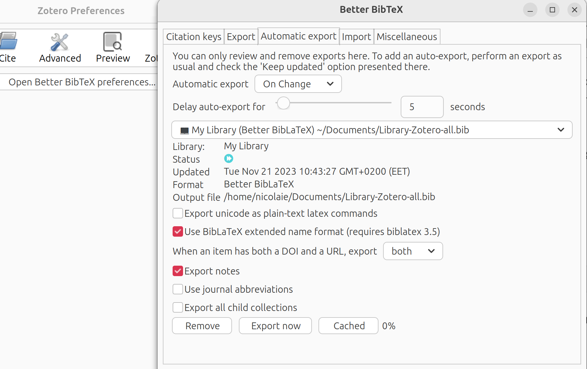{#2 width=70%}

Din Figura 2 se observă faptul că toți pașii exportului au fost îndepliniți corect. Căile sunt specifice unui sistem Linux. Pentru fișierul de export, în acest caz s-a optat pentru denumirea de `Library-Zotero-all.bib`.

# Instalarea pluginului Citations în Obsidian

În Obsidian vom avea nevoie să instalăm pluginul Citation disponibil din Community Plugins al lui Obsidian. Câteva informații despre acest plugin se pot obține și de la https://github.com/hans/obsidian-citation-plugin. Acesta este pluginul care va citi fișierul pe care l-am creat în pasul anterior. În cazul exemplului ilustrat în Figura 2, acesta se numește **Library-Zotero-all.bib**. Numele fișierului a fost ales arbitrar.

Acum, vom proceda la configurarea plugin-ului din Setările Obsidian și alegând din coloana stângă sub Community plugins pe Citations. Apoi, în rădăcina vault-ului vom crea un subdirector în care vor fi aduse notele pe care le-ai făcut pe documentele PDF consultate în Zotero. Aceste texte ale adnotărilor pot fi transformate în note de Obsidian.

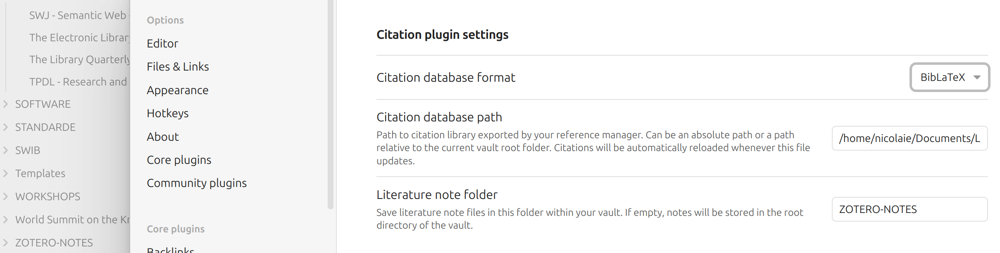{#3 width=90%}

Opțiunea de la *Citation database format* trebuie setată corespunzător. Se va alege BibLaTex (formatul ales pentru export anterior în Better Latex în Zotero). Apoi, la *Citation database path* se va pune calea întreagă până la fișierul live exportat din Zotero. În cazul unui sistem Linux, aceasta va fi similară cu următoarea: `/home/nicolaie/Documents/Library-Zotero-all.bib`. Ce mai trebuie făcut este să menționezi directorul în care vor fi create notele aduse din Zotero. În cazul ilustrat de Figura 3, subdirectorul din *vault* desemnat ca destinație a notelor din Zotero în Obsidian este denumit `ZOTERO-NOTES`. Acest subdirector trebuie creat în rădăcina vault-ului.

Mai departe, în setările acestui plugin de Obsidian, putem introduce un template (șablon) specializat pentru formatarea notei care va fi creată în *Literature note content template*. Un posibil șablon ar putea fi următorul.

```text
---
year: {{year}}
publisher: "{{publisher}}"
title: "{{title}}"
author: [{{authorString}}]
abstract: "{{abstract}}"
resources: ["{{DOI}}","{{URL}}"]
zotero: "{{citekey}}"
---
# {{title}}
{{authorString}}

{{abstract}}
```

Observă faptul că valorile câmpurilor pentru fiecare fragment de informație care va fi pus cap la cap în nota finală din Obsidian este menționat între acolade duble. În *template settings* sunt explicate câteva dintre valorile pe care le poți aduce din Zotero la momentul în care nota se construiește dinamic. În rest, nu este nimic special, ci numai markup-ul clasic al notei.
Adu-ți aminte de faptul că pentru a face sublinieri pe documentele PDF și pentru a crea note, ai nevoie de pluginul *Mdnotes* în Zotero.
Revenind la configurarea pluginului, dacă ai terminat cu propria combinație în ceea ce privește template-ul, poți să închizi și să te reîntorci la spațiul de lucru cu Obsidian-ul.

# Instalarea pluginului Zotero Integration în Obsidian

Acest plugin este foarte util pentru a obține aceeași experiență de interconectare strânsă pe care lucrul cu MS Office Word sau LibreOffice Writer le oferă prin instalarea unui plugin dedicat. Acest plugin permite aducerea adnotărilor în Obsidian. Lucrul pentru care este foarte util acest plugin este că poți importa datele bibliografice ca node distincte pentru fiecare înregistrare bibliografică. Tot ce are nevoie acest plugin pentru a face acest lucru este definirea unui șablon de formatare a datelor.
Pentru a-l instala, îl vei căuta în Community Plugins. Câteva informații utile, le găsești la https://github.com/mgmeyers/obsidian-zotero-integration. Pentru ca acest plugin să funcționeze corect, mai întâi trebuie să ai instalat pluginul Better BibTeX în Zotero (https://retorque.re/zotero-better-bibtex/installation/). După ce ai instalat pluginul în Obsidian, va trebui să treci prin etapa de configurare a acestuia.

## Configurarea pluginului Zotero Integration

La *PDF Utility*, va trebui să dai click pe Download pentru a fi instalat. Acest pas este necesar pentru a fi posibilă extragerea notelor din PDF-uri. Imediat după instalarea software-ului necesar, va fi afișat mesajul *PDF utility is up to date*.
A doua opțiune este necesară doar în cazul în care dorești să descarci manual utilitarul menționat mai sus (https://github.com/mgmeyers/pdfannots2json/releases). Este cazul în care anumite sisteme de operare au nevoie de anumite locații specifice pentru a pune acest binar executabil. Dacă la pasul anterior, a fost afișat mesajul *PDF utility is up to date* se va proceda la următorul pas.
La *Database* se va lăsa opțiunea Zotero doar dacă nu lucrezi cu Juris-M (o variantă de Zotero ceva mai specializată).
La *Note Import Location* este bine să precizați numele unui subdirector pe care l-ați creat în prealabil. Este preferabil să fie unul diferit față de ceea ce ai precizat pentru pluginul *Citations*. În cazul acestui tutorial, pentru pluginul Citations, am creat un subdirector numit `ZOTERO-NOTES`, iar pentru *Zotero Integration* am creat un subdirector numit `ZOTEROMDNOTES`.
La *Add citation format* am lăsat toate setările din oficiu, precizând la *Bibliography Style* stilul de citare pe care îl folosești pentru notele bibliografice. În cazul de față, am ales în formularul de căutare *University of Limerick (Cite it Right) - Harvard*. Poți căuta un stil de citare în prealabil folosind motorul de căutare a lui Zotero care este disponibil la: https://www.zotero.org/styles?q=University%20of%20Limerick. Reține faptul că ceea ce este scris la *Name* este chiar numele comenzii pe care o vei introduce atunci când vei dori introducerea citării activând panoul comenzilor prin CTRL+p.

În secțiunea *Import formats* avem câmpul *Output path* în care am completat numele subdirectorului dedicat pentru notele care sunt aduse, pe care tocmai l-am creat anterior. În cazul acestui tutorial: `ZOTEROMDNOTES/{{citekey}}.md`. Nu modifica `{{citekey}}.md` pentru că acesta este un fragment de șablon pe care îl folosește Obsidian pentru a completa automat numele notei de Obsidian pe care o va crea în subdirectorul  `ZOTEROMDNOTES`. Observă faptul că acel *citekey* este chiar identificatorul unic pe care Zotero îl atribuie înregistrării bibliografice. Introducerea acestuia între acolade duble îi spune lui Obsidian că acolo este un locțiitor pentru viitoarea valoare a lui `citekey` care va veni din Zotero la momentul importului. Este doar o convenție de sintaxă pentru a demarca locțiitorul.
Pentru *Image output path*, am creat un subdirector distinct numit arbitrar `MEDIA` în deja existentul `ZOTEROMDNOTES`. Aici vor fi introduse toate tăieturile de PDF reduse la capturi de imagine pentru fragmentele dorite la momentul în care s-a făcut adnotarea.
La *Image Base Name* nu modifica nimic, dar la *Bibliography style* caută din nou același stil de citare pe care l-ai menționat în *Add citation format*. Pentru acest tutorial este *University of Limerick (Cite it Right) - Harvard*. 

La *Import image settings* pentru opțiunea *Image OCR* trebuie să ai instalat în prealabil programul Tesseract (https://github.com/tesseract-ocr/tesseract), un software specializat pe recunoaștere optică a caracterelor care are o licență deschisă. Pentru instalare, consultați https://tesseract-ocr.github.io/tessdoc/Installation.html și https://github.com/tesseract-ocr/tessdoc/blob/main/Installation.md. La *Tesseract path* se va menționa calea către executabil, iar pentru *Image OCR language* am precizat opțiunea: `eng+ron`. Trebuie menționat faptul că nu este neapărat necesar să aveți instalat Tesseract. Acest este un bonus binevenit pe care acest plugin îl oferă.
Pentru Linux/GNU distribuția Ubuntu, conform https://tesseract-ocr.github.io/tessdoc/Installation.html și https://launchpad.net/~alex-p/+archive/ubuntu/tesseract-ocr5:

```bash
sudo add-apt-repository ppa:alex-p/tesseract-ocr5
sudo apt update
sudo apt install tesseract-ocr
sudo apt install tesseract-ocr-ron
```

Poți face o căutare pentru a vedea ce pachete sunt disponibile: `sudo apt-cache search tesseract`.
În final, pentru opțiunea *Tesseract data directory*, am introdus calea specifică către fișierele de date necesare recunoașterii optice pentru anumite limbi. În cazul Linux/GNU, distribuția Ubuntu, calea este `/usr/share/tesseract-ocr/5/tessdata`. Aici se găsesc următoarele fișiere de limbă: `eng.traineddata`,  `enm.traineddata`,  `osd.traineddata`și `ron.traineddata`. Pentru limba română, corespondentul este `ron.traineddata`.

## Crearea unui șablon pentru formatarea datelor

Pentru a prelua datele înregistrărilor din Zotero, ai nevoie să creezi un șablon pentru ca fiecare câmp al înregistrării din Zotero să devină o componentă a notei de Obsidian. Pentru a crea acest șablon ai nevoie să fie creat un director numit `Templates` în rădăcina vault-ului. În acest director vei crea un subdirector numit arbitrar `zotero-import`. Abia în acesta vei crea o nouă notă cu un nume pe care îl alegi arbitrar. Pentru acest tutorial, l-am numit `zotero-paper`.  Mai jos este conținutul acestei note.

```text
---
alias: ''
type: '{{itemType}}'
ids: 
 - citekey: '{{citekey}}'
 - doi: {{DOI}} 
 - url: {{url}}
 - isbn: {{ISBN}} 
 - zotero:
    - {{localLibrary}}
    - {{cloudLibrary}}
event: ''
year: {{date | format("YYYY")}}
proceedings: {{proceedingsTitle}}
journal: {{publicationTitle}}
vol: {{volume}} 
issue: {{issue}} 
partof: {{publicationTitle}} 
publisher: {{publisher}} 
place: {{place}} 
tags: [{{allTags}}]
title: '{{title}}'
resources:
 - ''
author: [{{authors}}{{directors}}]
abstract: '{{abstractNote}}'
---
# {{title}}
{{authors}}


      <h2>Abstract</h2>
	{{abstractNo--resource-path /home/nicolaie/Documents/obsidian-tutorials/images/ --csl https://raw.githubusercontent.com/citation-style-language/styles/master/harvard-limerick.csl --bibliography="/home/nicolaie/Documents/Library-Zotero-all.bib" --pdf-engine=/usr/bin/pdflatex --filter pandoc-crossref --number-sections --citeproc}}


linkuri: 
[ replace(" ", " "|{{attachment.title}}](file://{{attachment.path%20)}})  

<h2>Sublinieri</h2>

  
  
<mark style="background-color: {{color}}">Citat</mark>  

  
Notă:
  




<h3>{{calloutHeader(annotation.type, annotation.color)}}</h3>
	{{annotation.annotatedText}}
	<small>pag. {{annotation.page}}</small>

		



<em>Comentariu:</em> 
{{annotation.comment}}
<br>


<h2>Relations</h2>
 [@{{relation.citekey}}](@{{relation.citekey}}),  

<h2>Links</h2>
{# Aici se vor realiza linkurile automat în cazul în care vor fi importate și lucrările cu care aceasta este înrudită. #}
{# Trucul este să pui numele fișierului dar să-i faci alias citekey-ul din Zotero pentru că acesta se comportă drept cheie comună între note. #}
 [{{relation.citekey}}]({{relation.citekey}}),  
```

Observă faptul că este o structură pe care șabloanele Nunjucks le oferă. Pentru cei care doresc să modifice modul în care este compusă nota la momentul importului din Zotero, pot să o facă consultând https://github.com/mgmeyers/obsidian-zotero-integration/blob/main/docs/Templating.md și adaptând acolo unde au nevoie de un rezultat diferit. 
Vă veți întreba pe bună dreptate de unde am luat numele câmpurilor înregistrării din Zotero pentru a le pune în locțiitoarele de valori demarcate prin acolade duble precum `{{abstractNote}}`. Răspunsul este legat de posibilitatea inspectării a datelor care vor fi aduse din Zotero, folosind o altă opțiune pe care o pune la dispoziție *Zotero Integration*. Este vorba despre *Data explorer* care poate fi accesat prin apelarea panoului comenzilor CTRL+p de unde începi să cauți *Zotero Integration: Data Explorer*. Imediat se va deschide un panou suplimentar în partea dreaptă care va sublinia cu albastru numele câmpurilor pentru valorile care vor fi aduse din Zotero colorate cu verde.

{#4 width=80%}

Dacă priviți cu atenție prin comparație cu șablonul, veți înțelege foarte rapid care este modul de aranjament și cum se face înlocuirea cu valori atâta vreme cât ai menționat numele corect al câmpului pentru care vrei să preiei valoarea.

Un șablon precum cel de mai sus va crea în subdirectorul `ZOTEROMDNOTES` o nouă notă a cărui nume de fișier va fi chiar identificatorul unic pe a înregistrării din Zotero.

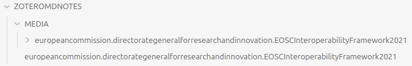{#5 width=90%}

În captura de mai sus, am surprins structura care s-a creat la momentul importului. Observă faptul că pentru fiecare notă, dacă adnotările au și capturi de imagine create pe fișierul PDF cu *Select Area*, acestea vor fi aduse într-un subdirector creat automat care are numele dat de id-ul înregistrării din Zotero. Astfel, nota va avea acces la acele capturi de imagine.

## Importul înregistrărilor din Zotero în Obsidian

Pentru a face importul notei bibliografice din Zotero, se va deschide panoul comenzilor folosind combinația CTRL+p. Apoi se va căuta comanda *Zotero Integration: Import paper*. 

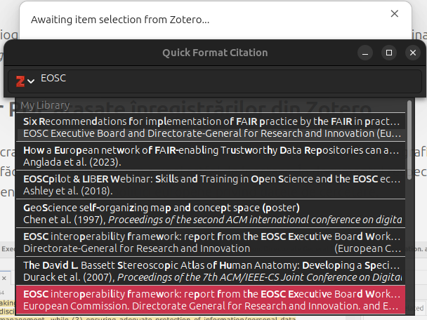{#6 width=80%}

Imediat va apărea panoul de căutare și selecție cu care sunteți deja familiarizați din interacțiunea similară în contextul utilizării MS Office Word sau LibreOffice Writer. În momentul în care ai confirmat alegerea cu ENTER, ceea ce se va petrece este preluarea datelor înregistrării bibliografice din Zotero și transformarea acestora cu tot cu adnotări într-o notă locală în Obsidian. Folosind șablonul de mai sus, am creat o notă pentru înregistrarea pentru care am optat.

Rezultatul este similar cu următoarea captură.

{#7 width=60%}

Citatele care au comentarii vor fi afișate precum în următoarea imagine.

{#8 width=75%}

Imaginile vor fi însoțite de propriile comentarii precum în captura de mai jos.

{#9 width=75%}

Ceea ce trebuie observat este faptul că au fost completate metadatele notei. Acest lucru este foarte prețios pentru tot ceea ce permite Obsidian să facă din moment ce le are la dispoziție. Cel mai accesibil exemplu este posibilitatea de a căuta după cuvintele cheie. Alte lucruri foarte utile ar fi exploatarea întregului vault ca o bază de date folosind un plugin foarte popular numit **Dataview**. Vom explora ceea ce putem face folosind Dataview în alt tutorial dedicat.

# Adnotarea fișierelor PDF atașate înregistrărilor din Zotero 

Să presupunem că în Zotero ai lucrat pe textul unui PDF care era atașament al unei înregistrări bibliografice dintr-o colecție. În figura de mai jos, am făcut o captură de ecran a unei astfel de ipostaze. În documentul respectiv, am multe sublinieri care sunt importante pentru studiul unor politici europene privind datele de cercetare.

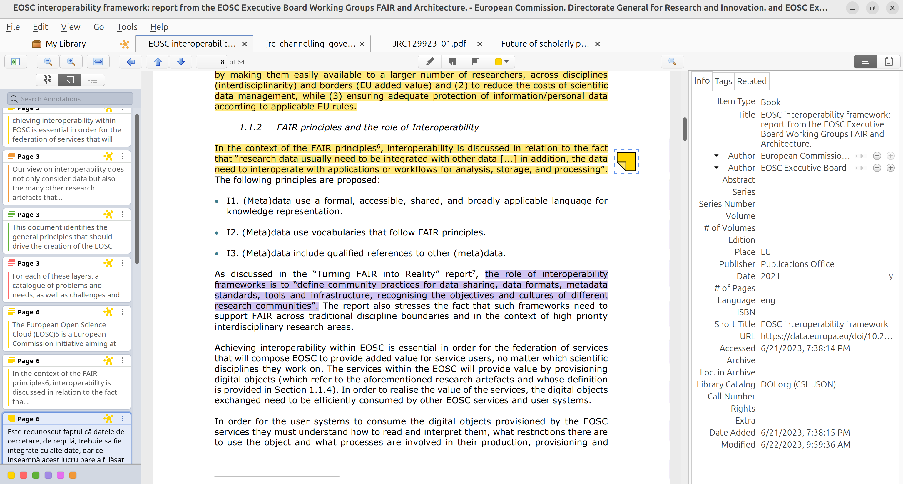{#10 width=70%}

După ce faci adnotările, va trebui să faci un pas suplimentar pentru a le integra ca parte componentă a înregistrării din Zotero.

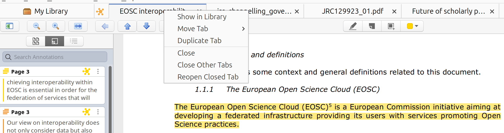{#11 width=70%}

Așa cum este ilustrat în figura de mai sus, pentru a te reîntoarce la notă, vei da click dreapta pe tabul de editare al PDF-ului din a cărui meniu alegi *Show in Library*. Acest pas te va duce direct la înregistrarea bibliografică din Zotero pentru care ai făcut adnotările.

{#12 width=70%}

După cum se vede în figura de mai sus va trebui să dăm click dreapta pe înregistrarea din Zotero, de unde optezi pentru *Add Note from Annotations*.

{#13 width=70%}

Privind mai atent la înregistrarea din Zotero, poți observa faptul că s-a adăugat la înregistrare o nouă *componentă*, un nou calup de adnotări intitulat generic *Annotations* sufixat cu data la care le-ai făcut.

Având pluginul *Better Notes* deja instalat, dacă vei da click pe notele proaspete în coloana din dreapta, vor fi afișate toate sublinierile pe care le-ai făcut în timp ce ai studiat PDF-ul. Dacă nu ai pluginul *Better Notes*, nu-i nicio problemă, vor fi afișate în coloana din drepta de către instrumentul specific al lui Zotero pentru că Zotero are propriul instrument de lucru cu adnotările. Totuși, *Better notes* este net superior, fiind și alegerea pentru acest tutorial.

Acest scenariu de lucru este îndeosebi foarte util atunci când lucrăm cu mai multe dispozitive. Dacă faci sublinieri și adnotări pe laptop, prin serviciul de sincronizare al Zotero, le vei avea disponibile și pe desktop ori pe tabletă.

## Gestionarea adnotărilor unei înregistrări din Zotero

Acest pas este util în cazul în care ai făcut adnotări pe un PDF atașat unei înregistrări bibliografice din Zotero și apoi dorești să le valorifici mai departe transformându-le în note de Obsidian. 

Înainte de a porni la extragerea notelor din Zotero, trebuie adusă în discuție o problemă legată de gestionarea versiunilor de adnotări care pot apărea. Să presupunem că ai te-ai apucat să studiezi un articol de cercetare pentru care ai făcut și câteva adnotări pe documentul în format PDF pe care îl ai atașat înregistrării bibliografice din Zotero. După ce ai făcut adnotările, le adaugi la înregistrare (click dreapta pe înregistrarea bibliografică și apoi *Add note from annotations*). Vei observa că o nouă componentă parte a înregistrării bibliografice va fi adăugată (extinde corpul înregistrării dând click pe triunghiul alb care o prefixează în interfața grafică. După o vreme, vei reveni asupra documentului și vei adăuga elemente de adnotare pe fișierul PDF. Pentru a le păstra atașate înregistrării, va trebui să repetăm operațiunea click dreapta pe înregistrarea bibliografică și apoi *Add note from annotations*. În acest moment, vom avea două versiuni ale adnotărilor. Una mai veche care la examinare, veți constata că nu are cele mai noi modificări și cea nouă, care va reflecta ultimele transformări (pot fi adaosuri sau din contră, note care sunt șterse).

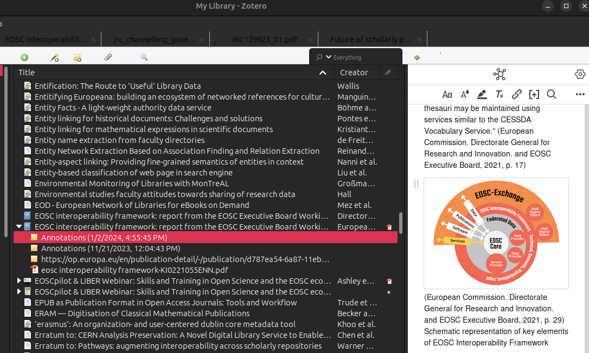{#14 width=90%}

În imaginea de mai sus, avem două versiuni pentru adnotările făcute. Prima este din 21 noiembrie, 2023, iar a doua este din 2 ianuarie, 2024. Cea de-a doua versiune a fost completată prin crearea unor capturi pe imagini folosind instrumentul *Select area* (vezi a treia opțiune din meniul central - indicat printr-un chenar de selecție). Reține faptul că în Obsidian, la momentul importului înregistrării prin pluginul Zotero Import, va fi importată cea mai nouă adnotare găsită.

# Extragerea notelor din Zotero în Obsidian

## Extragerea notelor folosind Zotero Integration

Notele pe care le-ai creat în Zotero pot fi extrase folosind pluginul **Zotero Integration**. Aceste note vor fi aduse în subdirectorul specificat la setarea *Note import location* atunci când am configurat acest plugin. În cazul tutorialului de față, subdirectorul creat este `ZOTEROMDNOTES`.
În acest moment, trebuie să ne gândim la aranjamentul conținutului notelor de Obsidian care vor fi generate la momentul importului. În cazul în care nu am prevedea în niciun fel cum vor fi create notele în baza adnotărilor importate, vom avea drept rezultat un import al întregului conținut al adnotării așa cum arată acesta în Zotero. Fără nicio formatare, totul la rând. Este ceea ce afișează Zotero prin **Better notes**.

{#15 width=60%}

Nu este nimic rău în acest mod de prezentare. Mai jos ar fi un import fără nicio pregătire a modului în care notele ar trebui să fie generate.

{#16 width=60%}

Totuși, ceea ce dorim să realizăm este net superior acestui nivel. Din acest motiv, va trebui să creăm un șablon de formatare a datelor care vin la momentul importului. Pentru acest lucru, am creat un subdirector numit `Templates` în rădăcina vault-ului. Numele `Templates` este preferabil, pentru că este posibil ca la un moment dat să-l folosiți cu pluginul *Templater*. În directorul `Templates` am creat subdirectorul `zotero-import`. Aici vom crea un șablon pentru a transforma notele din Zotero în note individuale în Obsidian. Șablonul nostru nu este nimic altceva decât o notă de Obsidian care are metadate și menționează niște locțiitori de valoare. Vom crea fișierul ca oricare altă notă. Putem să-l denumim arbitrar, dar pentru acest material îl vom numi `zotero-paper`.

# Sincronizarea Citations din Obsidian cu fișierul exportat din Zotero

După ce ai parcurs materialele dedicate studiului pentru a scrie un articol de cercetare, teză sau o notă care are nevoie de citări, vom trece în Obsidian pentru redactare.

Primul pas pe care îl vom face este să actualizăm baza de date cu referințe bibliografice generată de pluginul Citations. Pentru a face acest lucru, vom deschide panoul de comenzi (*Command Palette*), fie prin acționarea butonului din lista verticală din stânga (`>__`), fie apăsând combinația de taste **Ctrl (CMD pe Mac) + p**. Odată deschis panoul comenzilor, vom face o căutare începând să tastăm *Citations:*. Apar la vârf comenzile specifice pluginului Citations.

{#17 width=60%}

Din cele patru comenzi care apar, vom alege *Citations: Refresh citation database* pentru a ne asigura că baza internă a pluginului este sincronizată cu fișierul proaspăt scris pe hard disk la momentul în care am adăugat adnotările. Adu-ți mereu aminte faptul că fișierul creat mai sus (în cazul acestui tutorial **Library-Zotero-all.bib**) este actualizat automat la fiecare cea mai mică modificare pe care o faci în Zotero. Aceste modificări trebuie să se reflecte și în propria evidență a pluginului *Citations*. Din acest motiv facem acest *Refresh citation database*.

În cazul în care dintr-un motiv arbitrar fișierul exportat pe disc nu include ultimele modificări făcute în Zotero, forțează exportul apăsând pe butonul *Export now* (Edit -> Preferences -> Better BibTex -> Open Better BibTeX prefferences... -> Automatic Export tab -> Export now). Apoi, în Obsidian refă pașii pentru a reîmprospăta Citations (comanda *Citations: Refresh citation database*).

# Instalare Pandoc, Obsidian Pandoc Reference List și Pandoc Crossref

După ce vei redacta documentul în Obsidian, vei dori să creezi un document final prin transformarea Markdown-ului în alte formate caracteristice unor editoare de text precum LibreOffice (.odt de la Writer) sau MS Office (.docx de la Word).
Pentru a face aceste transformări, vei avea nevoie să instalezi un software numit **Pandoc**. Instalează Pandoc pe propriul sistem de operare urmând instrucțiuni de la pagina acestui software: https://pandoc.org/installing.html. În funcție de sistemul de operare, vei merge la https://github.com/jgm/pandoc/releases/latest, de unde vei alege pachetul sau executabilul necesar. Mai trebuie menționat faptul că preferabil este să aveți instalată cea mai recentă versiune a lui Pandoc. Verifică să ai instalat Pandoc folosind comanda `pandoc --version`. Răspunsul trebuie să fie similar cu:

```text
pandoc 3.1.11
Features: +server +lua
Scripting engine: Lua 5.4
User data directory: /home/nicolaie/.local/share/pandoc
Copyright (C) 2006-2023 John MacFarlane. Web: https://pandoc.org
This is free software; see the source for copying conditions. There is no
warranty, not even for merchantability or fitness for a particular purpose.
```

Fii foarte atent(ă) la ceea ce spune `User data directory` în răspunsul de la comanda `pandoc --version`. În subdirectorul `/home/nicolaie/.local/share` trebuie să existe un subdirector numit `pandoc`. Dacă nu există, ceea ce este firesc pentru Ubuntu, de exemplu, îl vei crea de mână: `mkdir /home/nicolaie/.local/share/pandoc`. În acest subdirector, creează un altul numit `templates`. În acest subdirector vor sta template-uri pe care le poți folosi în exportul din formatul Markdown (al notelor de Obsidian).

Dacă ai instalat Pandoc, procedează la instalarea pluginului *Obsidian Pandoc Reference List* a cărui descriere o poți consulta aici: https://github.com/mgmeyers/obsidian-pandoc-reference-list. Acest plugin de Obsidian este necesare pentru a afișa o listă dinamică a tuturor referințelor pe care le-ai făcut în text.

Mai trebuie instalat un plugin pentru Pandoc de data aceasta, care se dovedește absolut necesar pentru crearea și sincronizarea numărului de figuri din documentul pe care îl creezi, dar și pentru realizarea unui cuprins în regim automat. Acest plugin se numește **Pandoc Crossref** (https://lierdakil.github.io/pandoc-crossref/) și poate fi instalat de la https://github.com/lierdakil/pandoc-crossref/releases. Fii foarte atent la versiunea de Pandoc pe care o ai instalată deja și la versiunea de Pandoc pentru care instalezi pluginul Pandoc Crossref. Versiunile trebuie să corespundă, altfel vor apărea probleme. În cazul sistemului de lucru curent care este Linux/GNU distribuția Ubuntu 23.10, versiunea de Pandoc instalată este 3.1.11 pentru care se va descărca arhiva pluginului care a fost creat pentru această versiune: https://github.com/lierdakil/pandoc-crossref/releases/tag/v0.3.17.0b. În nota acestui release este specificat `built with Pandoc v3.1.11` ceea ce înseamnă că este fix pentru versiunea instalată pe sistem. Dezarhivează și din directorul rezultat, introdu următoarele comenzi:

```bash
sudo mv pandoc-crossref /usr/local/bin/
sudo chmod a+x /usr/local/bin/pandoc-crossref
sudo mkdir -p /usr/local/man/man1
sudo mv pandoc-crossref.1 /usr/local/man/man1
```

Soluția pentru Ubuntu a fost obținută de la https://askubuntu.com/questions/1335772/using-pandoc-crossref-on-ubuntu-20-04. Vom vedea mai jos cât de util se dovedește acest plugin. Inserarea figurilor, a tabelelor, diagramelor ș.a.m.d. face parte din construcția unei opere științifice și din acest motiv, pentru a realiza o transformare corectă a documentului de Markdown în alte formate finale, este necesară introducerea acestui plugin care suplimentează Pandoc-ul. Acest plugin este necesar și din motivul că Pandoc nu este un pachet software perfect, fiind necesar acest complement care adresează o suită de limitări și slăbiciuni. Una dintre problemele apărute chiar în realizarea acestui tutorial a fost generarea automată cu numerotare corectă a capitolelor, secțiunilor și subsecțiunilor: [Issue of --numbered-sections used with --base-header-level=2: produces 0.x.y · Issue #5071 · jgm/pandoc · GitHub](https://github.com/jgm/pandoc/issues/5071). Rezolvarea a venit de la Pandoc Crossref după cum veți vedea mai jos.

În ceea ce privește sistemul de operare MacOS, dacă ai instalat pandoc cu Brew, va trebui să instalezi și `pandoc-crossref` tot cu Brew.

În Obsidian, după ce ai instalat pluginul *Obsidian Pandoc Reference List*, mergi la opțiunile de configurare ale acestuia. Aici, primul lucru pe care trebuie să-l faci este să te asiguri că este specificată corect calea către executabilul programului Pandoc. În figura de mai jos, în cazul unui sistem Linux/GNU Ubuntu avem o cale specifică similară cu cea din imaginea de mai jos expusă prin comanda `which pandoc`.

{#18 width=70%}

Apoi, trebuie să trebuie să indici unde este fișierul acela live pe care îl salvează Zotero la orice modificare.

{#19 width=70%}

După aceasta trebuie să-i precizăm pluginului ce stil de citare dorim să folosim în lucrarea/nota noastră. Pentru a face acest lucru, poți introduce câteva caractere în câmpul de la *Citation style* și din lista mare poți identifica cel care te interesează. Am ales Harvard, varianta adaptată de Universitatea Limerick (Cite It Right).

{#20 width=85%}

În cazul în care dorești să precizezi stilul de citare folosind chiar un fișier CSL (https://citationstyles.org/) dedicat, mai întâi mergi și descarcă de la https://github.com/citation-style-language/styles stilul pe care îl dorești.

{#21 width=70%}

Pentru a-l descărca, mai întâi dă un click pe el și din panoul următor alege „Download Raw File”.

{#22 width=70%}

Pentru a obține un link direct către fișier, se va apăsa pe butonul *Raw*. De exemplu, pentru Harvard Limerick, apăsând pe Raw, se obține linkul: https://raw.githubusercontent.com/citation-style-language/styles/master/harvard-limerick.csl.

Având fișierul descărcat, poți să-l încarci de pe hard disk în câmpul de la *Custom citation style*.

{#23 width=70%}

# Referințe bibliografice în notele de Obsidian

Să presupunem că te-ai apucat să redactezi o notă în Obsidian și ai ajuns la punctul în care dorești să introduci o referință bibliografică. Pentru a face acest lucru, vei deschide din nou panoul comenzilor apăsând combinația de taste **Ctrl (CMD pe Mac) + p**. Vei începe să scrii la căutare *Citations* și din lista comenzilor care apar la vârf, vei alege *Citations: Insert Markdown Citations*. În panoul de căutare care va apărea, vei începe să scrii titlul lucrării pentru care vrei să creezi o referință bibliografică.

{#24 width=65%}

Pentru a crea cel mai bun exemplu, vom crea mai jos o propoziție la care am să adaug o referință bibliografică.

> Acesta este un fragment de text pentru exemplificare [@europeancommission.directorategeneralforresearchandinnovation.EOSCInteroperabilityFramework2021]

În exemplul acesta, observă faptul că baleierea referinței folosind mouse-ul (*hovering*) va avea drept efect afișarea notei bibliografice.

Trebuie lămurit următorul aspect legat de existența dublurilor în baza de date Zotero. În Figura 24 de mai sus se observă o situație care induce confuzie. Sunt două înregistrări bibliografice ale aceleiași opere. Acest lucru se petrece pentru că în lucrul intensiv cu Zotero, în funcție de anumite situații, vei copia referințele bibliografice dintr-o colecție în alta sau chiar vei avea intrări duble sau mai multe pentru că ai uitat că ai mai introdus-o în altă parte. În cazul din Figura 9, înregistrarea de care am nevoie este cea care este subliniată vizual în captura de ecran. În schimb, ca reper general de lucru foarte important așa cum vezi în Figura 16 de mai jos, fiecare înregistrare bibliografică din Zotero are o cheie unică de identificare menționată în coloana din dreapta; tabul **Info** -> Citation Key. Acesta este elementul care va face diferența dintre înregistrările bibliografice, fiind și elementul în baza căruia poți face alegerea înregistrării corecte.

{#25 width=70%}

Având instalat pluginul *Obsidian Pandoc Reference List*, referințele folosite în notă vor fi afișate dinamic în partea dreaptă.

{#26 width=70%}

Butonul din dreapta sus din coloana *References* permite copierea tuturor referințelor bibliografice și apoi introducerea în secțiunea bibliografiei lucrării pe care o elaborezi.

# Redactarea manuscrisului

Obiectivul acestei secțiuni este de a crea un manuscris al unei lucrări științifice folosind Obsidian. La final, rezultatul va fi un fișier Markdown care poate fi transformat în orice alt format se dorește (PDF, LaTeX sau Word). 

Primul pas este să creezi un vault nou dedicat articolului științific, capitolului, operei științifice pe care o vei redacta. Vei folosi instrumentele și convențiile de redactare pe care Obsidian ți le pune la dispoziție în stilul său caracteristic, care este ușor de înțeles și de utilizat: https://help.obsidian.md/Editing+and+formatting/Basic+formatting+syntax. 
Creează un subdirector numit arbitrar *images* în vault-ul creat, unde vei pune toate imaginile. Din setările aplicației Obsidian, vei merge la opțiunea *Files and links* -> *Default location for new attachments* din ale cărui opțiuni, vei opta pentru *In the folder specified below*. După ce ai făcut această selecție, mai jos, în câmpul denumit *Attachment folder path* vei introduce numele subdirectorului pe care l-ai creat în rădăcina vault-ului cu scopul de a pune imaginile. În cazul nostru, am ales *images*, dar pentru că Obsidian îl înțelege drept locul în care poți pune orice tip de fișiere pe care le poți încadra drept atașamente (vezi https://help.obsidian.md/Editing+and+formatting/Attachments), fără a se limita doar la imagini. Și pentru că am ajuns la imagini, pentru ca acestea să fie formatate corect la momentul exportului (*Obsidian Enhancing Export: Export to...*), introdu textul legendei drept text alternativ. Acest lucru va crea legenda pentru imaginea respectivă. În cazul în care imaginea este prea mare și dorești redimensionarea în rezultatul final, vei atașa la codul linkului specific pentru imagini, un fragment acceptat de Pandoc pentru redimensionare. Vezi explicațiile de la https://pandoc.org/MANUAL.html#extension-link_attributes via https://stackoverflow.com/questions/14675913/changing-image-size-in-markdown/41169162#41169162 . Un exemplu de introducere a unei imagini cu redimensionare: `{width=65%}`. O explicație pentru această formatare este legată de faptul că la momentul când se va face exportul documentului în format PDF, de exemplu, în subsidiar, pluginul Obsidian enhanced Export folosește filtre din colecția Pandoc Crossref (). Pentru imagini, un link care să vă ducă direct la explicația privind formatarea, aici: [pandoc-crossref(1) | pandoc-crossref](https://lierdakil.github.io/pandoc-crossref/#image-labels).

Câteva repere de redactare în Obsidian în vederea transformării în PDF la final:
- între text și marcajul pentru un nou heading, se va introduce un spațiu cu ENTER (new line);
- Părțile principale ale documentului vor fi marcate cu heading 1 (`# Un titlu`). Acest lucru este absolut necesar pentru numerotare corectă a capitolelor, subcapitolelor și secțiunilor documentului la momentul creării dinamice a cuprinsului. Vom vedea ceva mai jos că numerotarea va fi făcută automat nefiind necesară numerotarea de mână la momentul introducerii titlului;
- pune câte un spațiu gol între text și imaginea pe care o inserezi;
- pune câte un spațiu gol între paragrafe;
- fii foarte atent la numerotarea în ordinea corectă a imaginilor introduse (`{#28 width=70%}`). Dublarea unui număr are drept efect direct apariția unei erori la export. Verifică la final numerotarea corentă a imaginilor.

Să presupunem că ai redactat textul introducând și referințele bibliografice. De exemplu, pentru fragmentul demonstrativ de mai sus avem următoarea corespondență dintre referința bibliografică din text și citarea din bibliografie.

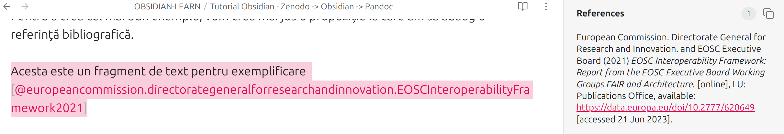{#27 width=70%}

Pentru a introduce o citare mai întâi activezi panoul comenzilor folosind combinația CTRL + P, unde începi să scrii comanda *Citations: Insert Markdown citation* din opțiunile care au apărut. Fii foarte atent(ă) să ai deja pluginul Citations instalat deja. Va apărea un nou meniu din care vei putea alege lucrarea pe care vrei să o citezi. Pentru a introduce o referință, mai poți lua următoarea cale: copiezi identificatorul unic din Zotero pe care îl vei pune între paranteze pătrate după prefixul `@`. Un exemplu este în Figura 18. Ceea ce este important pentru a face legătura cu înregistrarea din Zotero este identificatorul.

În ceea ce privește imaginile, dacă ai instalat deja Pandoc Crossref, tot ce trebuie să faci este să adaugi în linkul de imagine, la final următorul fragment, pe care îl particularizezi conform fiecărei explicații pe care o aduci: `{#număr_figură:numele_figurii_introduse}`. Un link complet ar fi asemănător cu `{#număr_figură:numele_figurii_introduse}`.
La fel vei putea proceda cu numele secțiunilor: `# Nume secțiune {#sec:nume_secțiune}`.

# Exportul manuscrisului în alte formate

Pentru a putea face un export al fișierului Markdown în alte formate utile pentru a satisface cerințele editoriale diverse, vom avea nevoie ca **Pandoc** și **Pandoc-Crossref** să fie deja instalate. Acestea sunt programe care se instalează la nivelul sistemului de operare. Pentru Obsidian vom avea nevoie de *Obsidian Link Converter* (https://github.com/ozntel/obsidian-link-converter) și de *Obsidian Enhancing Export* (https://github.com/mokeyish/obsidian-enhancing-export). Mai întâi de toate, verifică să ai instalat Pandoc folosind comanda `pandoc --version`. Răspunsul trebuie să fie similar cu:

```text
pandoc 3.1.11
Features: +server +lua
Scripting engine: Lua 5.4
User data directory: /home/nicolaie/.local/share/pandoc
Copyright (C) 2006-2023 John MacFarlane. Web: https://pandoc.org
This is free software; see the source for copying conditions. There is no
warranty, not even for merchantability or fitness for a particular purpose.
```

## Instalare LaTeX

### Instalare LaTeX în Ubuntu 23.10

Instalarea în Ubuntu se face rulând comanda `sudo apt-get install texlive-full`. Pașii de instalare au fost reproduși după ghidul de la [How to Install LaTeX on Ubuntu for Efficient Document Preparation?](https://geekflare.com/how-to-install-latex-on-ubuntu/).  Această instalare este de dorit pentru a asigura cel mai bun suport de interpretare a documentelor LaTeX în general și în special pentru a înțelege șabloanele de export folosite de pluginul *Obsidian Enhancing export*. Această instalare nu este neapărat necesară, dar o recomand.
Pentru a verifica instalarea corectă, se va investiga cu `latex --version`. Răspunsul trebuie să fie similar cu:

```text
pdfTeX 3.141592653-2.6-1.40.25 (TeX Live 2023/Debian)
kpathsea version 6.3.5
Copyright 2023 Han The Thanh (pdfTeX) et al.
There is NO warranty.  Redistribution of this software is
covered by the terms of both the pdfTeX copyright and
the Lesser GNU General Public License.
For more information about these matters, see the file
named COPYING and the pdfTeX source.
Primary author of pdfTeX: Han The Thanh (pdfTeX) et al.
Compiled with libpng 1.6.40; using libpng 1.6.40
Compiled with zlib 1.2.13; using zlib 1.2.13
Compiled with xpdf version 4.04
```

Un editor grafic pentru Gnome se poate instala folosind comanda `sudo apt-get install latexila*`.

Dacă dorești să folosești la nivel expert pluginul Obsidian Enhancing Export, instalează template-ul Eisvogel, pe care îl găsiți la [GitHub - Wandmalfarbe/pandoc-latex-template: A pandoc LaTeX template to convert markdown files to PDF or LaTeX.](https://github.com/Wandmalfarbe/pandoc-latex-template). Copiază fișierul în subdirectorul templates. Un exemplu este calea locală a sistemului Ubuntu pe care este scris acest tutorial: `/home/nicolaie/.local/share/pandoc/templates`. Unul din șabloanele folosite de  pluginul *Obsidian Enhancing export* este chiar o copie a lui Einsvogel.

## Configurarea lui Obsidian Enhancing Export

În acest tutorial, avem drept țintă generarea unui fișier PDF dintr-o notă Obsidian, care, de fapt, este o lucrare de mai mari dimensiuni așa cum este cea de față. Pentru acest lucru, pluginul *Obsidian Enhancing Export* are nevoie de câteva setări suplimentare absolut necesare.

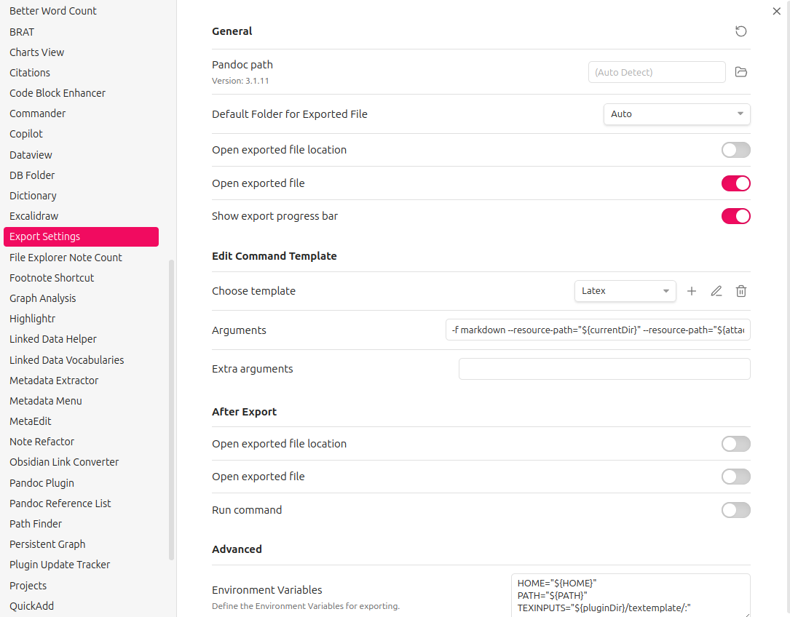{#28 width=70%}

În câmpul *Extra arguments* trebuie introduse câteva argumente suplimentare, care vor fi adăugate la momentul execuției comenzii de transformare. Primul argument este `--resource-path` care indică unde este subdirectorul în care sunt ținute imaginile documentului. De exemplu: `--resource-path ~/Documents/Idei/OBSIDIAN-LEARN/images/`, care specifică calea absolută unde este subdirectorul în care sunt toate imaginile necesare. Dacă nu menționezi nimic, pluginul se va baza pe directorul specificat drept attachments.

Trebuie menționat faptul că valoarea din câmpul *Arguments* este prima parte a opțiunilor ce însoțesc execuția programului *pandoc*. Ceea ce se observă investigând această valoare, este faptul că s-a optat pentru parametrizarea unor argumente:

```bash
-f markdown --resource-path="${currentDir}" --resource-path="${attachmentFolderPath}" --lua-filter="${luaDir}/pdf.lua" ${ options.textemplate ? `--resource-path="${pluginDir}/textemplate" --template="${options.textemplate}"` : ` ` } -s -o "${outputPath}" -t pdf
```

De exemplu, prima căutare a resurselor necesare alcătuirii unui fișier viabil la momentul exportului este specificată de valoarea parametrizată `${currentDir}` a argumentului `--resource-path=""`. Apoi, sunt căutate alte resurse care ar fi necesare făcând o specificare să acestea ar putea fi puse în subdirectorul care este specficat drept atașamente ale vault-ului curent prin parametrul `${attachmentFolderPath}`.

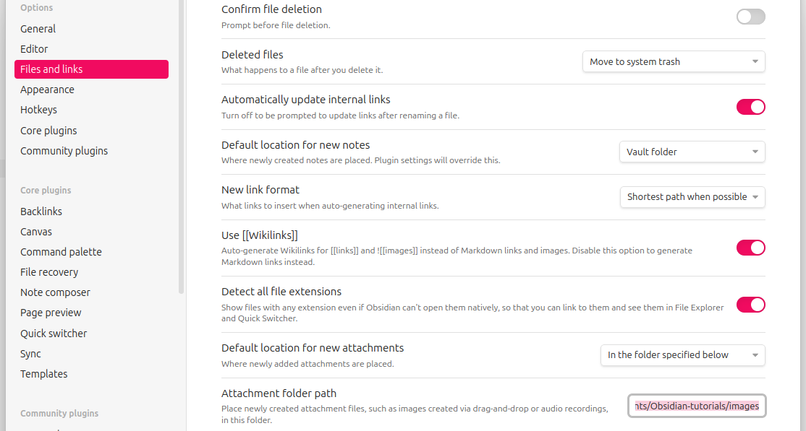{#29 width=70%}

Urmează o serie de argumente suplimentare care le completează pe cele specificate în câmpul *Arguments*, care sunt la alegerea utilizatorului. Aceste vor fi menționate în *Extra arguments*. Observă faptul că este un subdirector al vault-ului.

Să explorăm câteva dintre opțiunile pe care le-am introdus în *Extra arguments* pentru a genera un PDF chiar din acest document.

Folosind argumentul `--bibliography="Library-Zotero-all.bib"` căruia îi dai drept valoare numele fișierului în care Zotero face exportul bibliografiei indici programului Pandoc ca la momentul execuției să introducă și bibliografia pentru documentu curent pe care îl transformă. Drept rezultat, la momentul exportului va fi introdusă și bibliografia la final. Chiar poți indica și ce standard bibliografic îl preferi prin menționarea fișierului `.csl` drept valoare argumentului `--csl`. De exemplu, pentru Harvard Limerick vei avea: https://raw.githubusercontent.com/citation-style-language/styles/master/harvard-limerick.csl. Poți menționa calea absolută către fișier dacă l-ai descărcat deja pe sistemul de operare. Un exemplu este dat mai jos.
Trebuie specificat care este calea către programul de lucru cu pdf-urile. Calea o afli prin execuția comenzii în Terminal: `which pdflatex` pe sistemul de operare Linux/GNU, distribuția Ubuntu sau MacOS. Apoi pentru a completa argumentul: `--pdf-engine=/usr/bin/pdflatex`.
Argumentul `--filter` este necesar pentru a trata imaginile corespunzător, fiind locul în care pluginul Pandoc-ului, *pandoc-crossref* este folosit: `--filter pandoc-crossref`. 
Argumentul `--citeproc` va instrui Pandoc să afișeze corect citările.

Mai jos este un exemplu de configurări specifice transformării pe care Pandoc o va aplica pentru acest document al tutorialului.

```bash
--csl https://raw.githubusercontent.com/citation-style-language/styles/master/harvard-limerick.csl --bibliography="/home/nicolaie/Documents/Library-Zotero-all.bib" --pdf-engine=/usr/bin/pdflatex --filter pandoc-crossref --toc=true --standalone -V toc-title:"Cuprins" --top-level-division=chapter --citeproc
```

Setările de mai sus le vei pune în câmpul *Extra arguments*. Pentru opțiuni, vezi și documentația pentru opțiunile generale de la [pandoc-crossref(1) | pandoc-crossref](https://lierdakil.github.io/pandoc-crossref/#general-options).

Pentru ca aceste setări să producă un efect, trebuie însoțite de alte câteva care trebuie puse în metadatele documentului pe care dorești să-l transformi. Un exemplu sunt chiar metadatele din deschiderea acestui document.

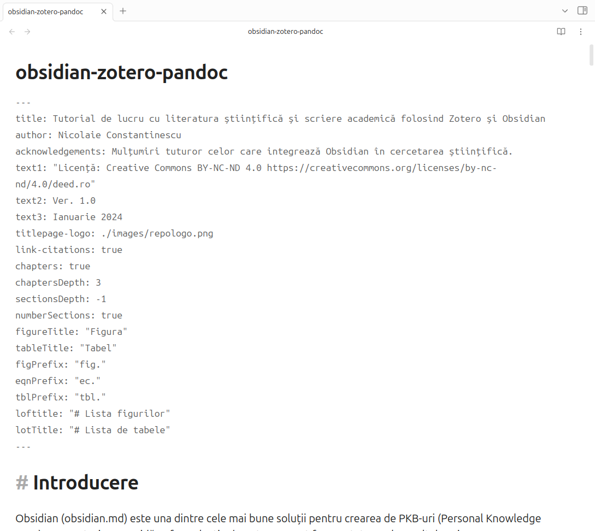{#30 width=70%}

În imaginea de mai sus am pus chiar un screenshot al acestora pentru a face legătura rapid. Dacă ai deschis acest document în Obsidian, pentru a vedea metadatele ca sursă îți recomand vizualizarea în *Source mode*. Partea care este necesară filtrelor Pandoc Crossref sunt următoarele:

```yaml
link-citations: true
chapters: true
chaptersDepth: 3
sectionsDepth: -1
numberSections: true
figureTitle: "Figura"
tableTitle: "Tabel"
figPrefix: "fig."
eqnPrefix: "ec."
tblPrefix: "tbl."
loftitle: "# Lista figurilor"
lotTitle: "# Lista de tabele"
```

Dacă redactezi documente în limba română, adaugă setările de mai sus la metadatele existente deja.

## Convertirea linkurilor pentru a pregăti exportul

Primul pas este convertirea tuturor linkurilor la formatul specific lui Markdown. Pandoc așteaptă un format Markdown curat. Obsidianul permite anumite deviații care nu ar fi interpretate corect la momentul în care Pandoc face transformarea. Pentru a transforma, se deschide panoul comenzilor cu CTRL+P, de unde se alege *Vault: Links to Markdown*.

{#31 width=100%}

Conversia se va aplica linkurilor din document, precum și imaginilor.

## Alegerea unui template - avansat

Această etapă nu este necesară, fiind un reper pentru extinderea viitoare a acestui tutorial.
Pluginul *Obsidian enhancing export* are în directorul rădăcină (al pluginului) un subdirector numit `textemplate`. Aici sunt câteva exemple de șabloane LaTex care sunt utilizate atunci când faci un export - `/home/nicolaie/Documents/Obsidian tutorials/.obsidian/plugins/obsidian-enhancing-export/textemplate`.

Pentru mai multe șabloane care să fie introduse prin copierea în acest subdirector, vezi https://github.com/universvm/obsidian-pandoc-templates.

# Exportul documentului în format PDF

Dacă avem documentul pregătit, ultimul pas este să facem exportul apelând panoul comenzilor din Obsidian folosind comanda CTRL + P în al cărui câmp de căutare vei scrie *Export*. Una dintre opțiunile care apar este *Obsidian Enhancing Export: Export to...* pe care o vom alege. Va apărea un panou nou care va permite salvarea ca PDF.

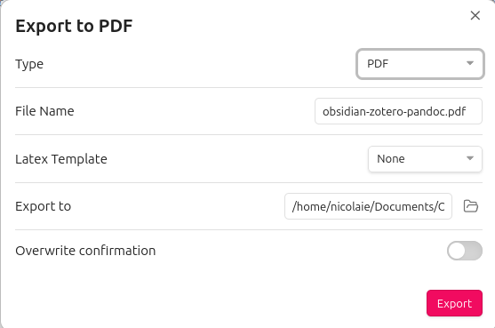{#32 width=100%}

Acest pas va crea un fișier PDF nou nouț care în afară de conținut ul documentului, va conține bibliografia și cuprinsul. Mai mult, va numerota părțile documentului automat.
# Resurse utile

Pandoc wiki: [Home · jgm/pandoc Wiki · GitHub](https://github.com/jgm/pandoc/wiki)
Problemele legate de modul în care este generat cuprinsul: [Issue of --numbered-sections used with --base-header-level=2: produces 0.x.y · Issue #5071 · jgm/pandoc · GitHub](https://github.com/jgm/pandoc/issues/5071)
Pandoc Crossref: [pandoc-crossref(1) | pandoc-crossref](https://lierdakil.github.io/pandoc-crossref/)